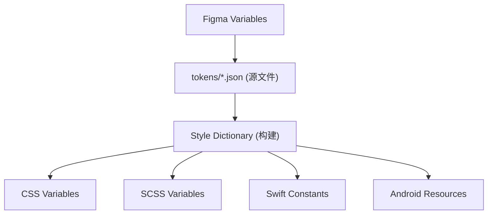

# 📁 Token 文件结构

本文档说明 YAMI 设计系统 Design Token 的文件组织结构，便于开发团队管理和维护。

---

## 目录结构

```filetree
tokens/
├── base/                    # 基础 Token（原始值）
│   ├── colors.json          # 调色板
│   ├── typography.json      # 字体定义
│   ├── spacing.json         # 间距值
│   ├── radius.json          # 圆角值
│   └── shadows.json         # 阴影值
│
├── semantic/                # 语义化 Token（引用基础 Token）
│   ├── colors.json          # 语义色（text, background, border...）
│   ├── typography.json      # 字体层级
│   └── components.json      # 组件级 Token
│
├── themes/                  # 主题层
│   ├── light.json           # 亮色主题
│   └── dark.json            # 暗色主题
│
└── platforms/               # 平台导出
    ├── web/
    │   ├── variables.css    # CSS 变量
    │   └── tokens.scss      # SCSS 变量
    ├── ios/
    │   └── tokens.swift     # Swift 常量
    └── android/
        └── tokens.xml       # Android 资源
```

---

## 文件层级说明

### 1. 基础层 (Base)

存储原始设计值，不引用其他 Token。


### 2. 语义层 (Semantic)

通过引用基础 Token 建立语义映射。


### 3. 主题层 (Themes)

定义不同主题下语义 Token 的具体映射。


### 4. 平台层 (Platforms)

由构建工具自动生成，供各平台消费。


## 构建工具

推荐使用 [Style Dictionary](https://amzn.github.io/style-dictionary/) 或 [Tokens Studio](https://tokens.studio/) 进行 Token 管理与多平台导出。

### 构建流程



---
