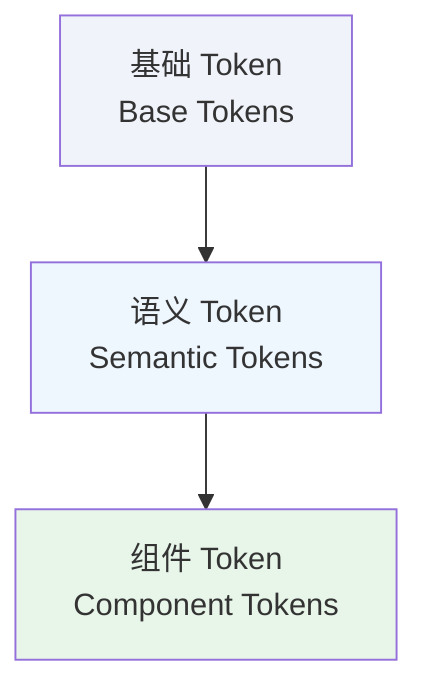

# 📋 Token 概述

Design Token 是设计系统的核心基础设施，将设计决策转化为可在代码中复用的变量，确保设计与开发之间的一致性。

---

## 什么是 Design Token

Design Token 是存储设计属性（如颜色、间距、字体）的命名实体，用于替代硬编码的数值。

**示例对比**：

❌ **硬编码**：
```css
.button {
  background: #E00000;
  padding: 12px 16px;
  border-radius: 8px;
}
```

✅ **使用 Token**：
```css
.button {
  background: var(--ui-primary);
  padding: var(--space-150) var(--space-200);
  border-radius: var(--radius-medium);
}
```

---

## Token 的优势

### 1. 一致性
所有组件使用相同的 Token，确保视觉统一。

### 2. 可维护性
修改 Token 值即可全局更新，无需逐个修改组件。

### 3. 跨平台同步
从单一数据源生成多平台代码（Web、iOS、Android）。

### 4. 语义化
Token 名称传达用途（如 `ui/primary`），而非具体值（如 `#E00000`）。

---

## Token 分层架构

YAMI 设计系统采用三层 Token 架构：



### 1️⃣ 基础 Token (Base Tokens)

存储原始设计值，不引用其他 Token。

**示例**：
- `color/red-500: #E00000`
- `space-200: 16px`
- `radius-medium: 8px`

### 2️⃣ 语义 Token (Semantic Tokens)

通过引用基础 Token 建立语义映射，传达用途而非具体值。

**示例**：
- `ui/primary → color/red-500`
- `text/primary → rgba(0,0,0,0.87)`
- `border/normal → rgba(0,0,0,0.08)`

### 3️⃣ 组件 Token (Component Tokens)

为特定组件定义的 Token，引用语义 Token。

**示例**：
- `button/primary/background → ui/primary`
- `card/padding → space-200`
- `modal/border-radius → radius-large`

---

## 在代码中使用 Token

### CSS 变量

```css
/* 使用语义变量 */
.card {
  background: var(--background-secondary);
  padding: var(--space-200);
  border-radius: var(--radius-large);
  box-shadow: var(--elevation-100);
}
```

### 直接引用 Token

```css
/* 引用 Token CSS 类 */
@import 'styles/tokens.css';

.button-primary {
  background: var(--ui-primary);
}
```

---

## Token 与 Figma 同步

### 工作流程

1. **设计**：在 Figma 中定义 Variables
2. **导出**：通过插件导出为 `tokens.json`
3. **生成**：运行 `scripts/generate-tokens.py` 生成 CSS
4. **应用**：在代码中使用 CSS 变量

### 文件路径

- **Token 源**：`tokens/tokens.json`
- **生成的 CSS**：`styles/tokens.css`
- **语义变量**：`app/globals.css`

---

## 使用原则

### ✅ 推荐做法

- 优先使用**语义 Token**（如 `--foreground-primary`）
- 在组件中使用 **CSS 变量**，不硬编码数值
- 新增颜色时先定义 Token，再使用

### ❌ 避免做法

- 直接使用 hex 值或 rgba 值
- 绕过 Token 系统自定义颜色
- 在多处重复定义相同的数值

---

## 相关文档

- [Token 参考表](📊%20Token%20参考表.md) - 完整 Token 数值速查
- [Token 命名规范](📝%20Token命名规范.md) - Token 命名规则
- [Token 文件结构](📁%20Token文件结构.md) - Token 文件组织
- [Token 更新日志](📜%20Token更新日志.md) - Token 变更记录
