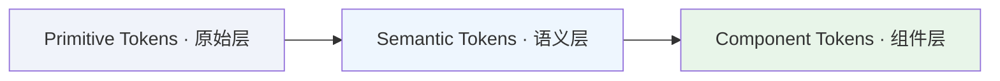

# 📋 Token 概述

Design Token 是设计系统的核心基础设施,将设计决策转化为可在代码中复用的命名变量,确保设计与开发之间的一致性。

---

## 什么是 Design Token

Design Token 是存储设计属性(如颜色、间距、字体)的命名实体,用于替代硬编码的数值。

```css
/* 硬编码 */
.button { background: #E00000; padding: 12px 16px; }

/* 使用 Token */
.button { background: var(--surface-brand-contrast); padding: var(--space-150) var(--space-200); }
```

---

## Token 的优势

- **单一真理源**: 设计与代码使用相同的 Token 名称,消除歧义
- **提高效率**: 修改 Token 值即可全局更新,无需逐个修改组件
- **跨平台同步**: 从单一数据源生成多平台代码(Web、iOS、Android)

---

## Aliasing (别名引用)

Token 可以引用其他 Token 的值。当被引用的 Token 改变时,所有引用它的 Token 自动更新。

```
surface/brand-contrast → pink/400
```

---

## Token 三层结构

YAMI 设计系统采用 Figma 推荐的三层 Token 架构:



### Primitive Tokens (原始层)

定义系统中所有的原始值,**仅供引用,不直接使用**。

**特点**:
- 包含具体的数值(颜色、尺寸、间距等)
- 不引用其他 Token
- 在 Figma 中可隐藏,避免被直接应用

**示例**:
```json
{
  "pink": {
    "400": { "value": "#E00000" }
  },
  "neutral": {
    "900": { "value": "#1A1A1A" }
  }
}
```

---

### Semantic Tokens (语义层)

通过引用 Primitive Tokens 传达用途,**可直接使用**。

**特点**:
- 引用 Primitive Tokens
- 名称描述用途(如 `surface/brand-contrast`)
- 便于主题切换

**示例**:
```json
{
  "surface": {
    "brand-contrast": { "value": "{pink.400}" }
  },
  "text": {
    "primary": { "value": "{neutral.900}" }
  }
}
```

**命名解析**: `surface/brand-contrast`
- `surface` - 用于背景色
- `brand` - 品牌核心色
- `contrast` - 高对比度,吸引注意力

---

### Component Tokens (组件层)

为特定组件定义 Token,**可直接使用**。适合大型企业级系统。

#### 特点:
- 指定在哪里使用
- 引用 Semantic Tokens
- 可选(中小型系统可能不需要)

#### 示例:
```json
{
  "button": {
    "primary": {
      "background": {
        "default": { "value": "{surface.brand-contrast}" }
      }
    }
  }
}
```

#### 命名格式: `{组件}-{类型}-{属性}-{状态}`
- 示例: `button-primary-background-default`

---

## Variables vs Styles

Figma 提供两种方式管理 Token: **Variables** 和 **Styles**。

| 特性 | Variables | Styles |
|------|-----------|--------|
| **支持别名** | 支持 (引用其他 Variables) | - |
| **多模式(主题)** | 支持 (亮色/暗色模式) | - |
| **作用域控制** | 支持 (可限制范围) | - |
| **代码语法** | 支持 (更好的交付) | - |
| **渐变色** | - | 支持 |
| **复合值** | - | 支持 (多重填充/阴影) |

#### 建议: 结合使用 Variables 和 Styles
- 大部分 Token 使用 Variables
- 渐变色使用 Styles

---

## 使用 Token

### 在 Figma 中

- 创建 `Primitives` Collection(隐藏发布)
- 创建 `Tokens` Collection(发布到团队库)
- 应用 Semantic/Component Tokens,避免直接使用 Primitive Tokens

### 在代码中

```css
.card {
  background: var(--surface-primary);
  padding: var(--space-200);
}
```

### 详细工作流：从设计到代码

YAMI 采用自动化的 Token 交付链路，确保设计变更能快速、准确地同步到代码库：

1.  **Figma Variables (定义)**
    在 Figma 中通过 Collections 建立原始层 (Primitive) 和语义层 (Semantic) 变量。设计师在此进行所有视觉决策的定义与维护。
2.  **自动化导出 (交付)**
    使用插件（如 Tokens Studio 或 Figma 原生 Variables 导出工具）将设计变量导出为标准的 JSON 数据格式，作为单一真理源 (SSoT)。
3.  **Style Dictionary (转换)**
    利用 [Style Dictionary](https://amzn.github.io/style-dictionary/) 工具链对 JSON 进行处理。它负责处理平台差异（如将十六进制转换为 CSS rgba），并编译生成多端适配的变量文件（CSS Variables, JS Tokens, iOS/Android XML 等）。
4.  **项目应用 (集成)**
    最终生成的 CSS 变量文件（如 `tokens.css`）被引入前端项目。开发者直接通过 `var(--token-name)` 引用变量，实现样式与设计的实时同步。

---

## 使用原则

**推荐**: 使用 Semantic Tokens、CSS Variables、先定义后使用

**避免**: 直接使用 Primitive Tokens、硬编码数值、绕过 Token 系统

---

## 相关文档

- [Token 命名规范](02_📝%20Token命名规范) - Token 命名规则
- [Token 文件结构](03_📁%20Token文件结构) - Token 文件组织
- [Token 更新日志](04_📜%20Token更新日志) - Token 变更记录
