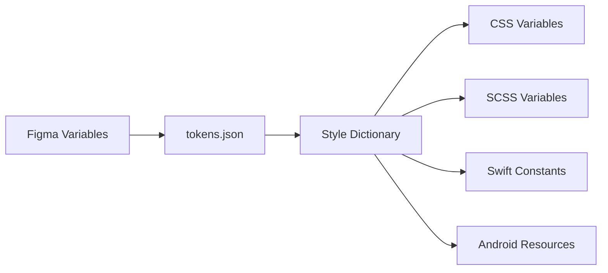

# 📁 Token 文件结构

本文档说明 YAMI 设计系统 Design Token 在 Figma 和代码中的组织结构。

---

## Figma Variables Collections

在 Figma 中,Token 通过 **Variables Collections** 组织。

### Primitives Collection (原始层)

存储所有原始值,**仅供引用**。

#### 设置:
1. 创建名为 `Primitives` 的 Variables Collection
2. 添加所有原始值(颜色、间距、圆角等)
3. **隐藏发布**: 右键 → Edit variables → 取消勾选 "Show in all supported properties"

#### 示例:
```filetree
Primitives/
├── pink/
│   ├── 50: #FFF0F5
│   ├── 100: #FFE0EB
│   ├── 400: #E00000
│   └── 900: #5C0011
├── neutral/
│   ├── 0: #FFFFFF
│   ├── 50: #FAFAFA
│   └── 900: #1A1A1A
└── space/
    ├── 050: 4px
    ├── 100: 8px
    └── 200: 16px
```

---

### Tokens Collection (语义层 + 组件层)

存储 Semantic 和 Component Tokens,**可直接使用**。

#### 设置:
1. 创建名为 `Tokens` 的 Variables Collection
2. 添加 Semantic Tokens(引用 Primitives)
3. (可选)添加 Component Tokens

#### 示例:
```filetree
Tokens/
├── surface/
│   ├── brand-contrast → {pink.400}
│   ├── primary → {neutral.0}
│   └── secondary → {neutral.50}
├── text/
│   ├── primary → {neutral.900}
│   └── secondary → {neutral.600}
└── button/
    └── primary/
        └── background/
            ├── default → {surface.brand-contrast}
            └── hover → {pink.500}
```

---

## 代码文件结构

### 推荐结构

```filetree
tokens/
├── primitives/              # 原始层
│   ├── colors.json          # 调色板
│   ├── typography.json      # 字体定义
│   ├── spacing.json         # 间距值
│   ├── radius.json          # 圆角值
│   └── shadows.json         # 阴影值
│
├── semantic/                # 语义层
│   ├── colors.json          # 语义色
│   ├── typography.json      # 字体层级
│   └── spacing.json         # 语义间距
│
├── components/              # 组件层(可选)
│   ├── button.json          # 按钮 Tokens
│   └── card.json            # 卡片 Tokens
│
└── build/                   # 构建产物(自动生成)
    ├── web/
    │   ├── variables.css    # CSS Variables
    │   └── tokens.scss      # SCSS Variables
    ├── ios/
    │   └── tokens.swift     # Swift 常量
    └── android/
        └── tokens.xml       # Android 资源
```

---

## 文件层级说明

### 1. Primitives (原始层)

存储原始设计值,不引用其他 Token。

**特点**:
- 包含具体的数值
- 不依赖其他 Token
- 仅供 Semantic Tokens 引用

**示例** (`primitives/colors.json`):
```json
{
  "pink": {
    "400": { "value": "#E00000" }
  },
  "neutral": {
    "900": { "value": "#1A1A1A" }
  }
}
```

---

### 2. Semantic (语义层)

通过引用 Primitive Tokens 建立语义映射。

#### 特点:
- 引用 Primitive Tokens
- 名称描述用途
- 可直接在设计和代码中使用

#### 示例 (`semantic/colors.json`):
```json
{
  "surface": {
    "brand-contrast": { "value": "{pink.400}" }
  },
  "text": {
    "primary": { "value": "{neutral.900}" }
  }
}
```

---

### 3. Components (组件层)

为特定组件定义 Token,可选。

**特点**:
- 指定在哪里使用
- 引用 Semantic Tokens
- 适合大型企业级系统

**示例** (`components/button.json`):
```json
{
  "button": {
    "primary": {
      "background": {
        "default": { "value": "{surface.brand-contrast}" },
        "hover": { "value": "{pink.500}" }
      }
    }
  }
}
```

---

## Figma → Code 工作流

### 1. 在 Figma 中定义 Variables

1. 创建 `Primitives` Collection(隐藏发布)
2. 创建 `Tokens` Collection(发布到团队库)
3. 使用 Aliasing 建立引用关系

---

### 2. 导出 Token

使用 Figma 插件导出为 `tokens.json`:
- [Tokens Studio](https://tokens.studio/)
- [Design Tokens](https://www.figma.com/community/plugin/888356646278934516)

---

### 3. 生成多平台代码

使用 [Style Dictionary](https://amzn.github.io/style-dictionary/) 构建:

```bash
# 安装 Style Dictionary
npm install -D style-dictionary

# 构建 Tokens
npx style-dictionary build
```

**构建流程**:



---

### 4. 在代码中使用

```css
/* 使用生成的 CSS Variables */
.button-primary {
  background: var(--surface-brand-contrast);
  padding: var(--space-150) var(--space-200);
  border-radius: var(--radius-medium);
}
```

---

## 最佳实践

### ✅ 推荐做法

- 在 Figma 中隐藏 Primitive Tokens,避免被直接使用
- 使用 Aliasing 建立 Token 之间的引用关系
- 定期同步 Figma 与代码库的 Token
- 使用自动化工具生成多平台代码

### ❌ 避免做法

- 手动编辑 `build/` 目录下的文件
- 在设计中直接使用 Primitive Tokens
- 绕过 Style Dictionary 手动维护平台代码

---

## 相关文档

- [Token 概述](01_📋%20Token概述) - Token 概念与使用
- [Token 命名规范](02_📝%20Token命名规范) - Token 命名规则
