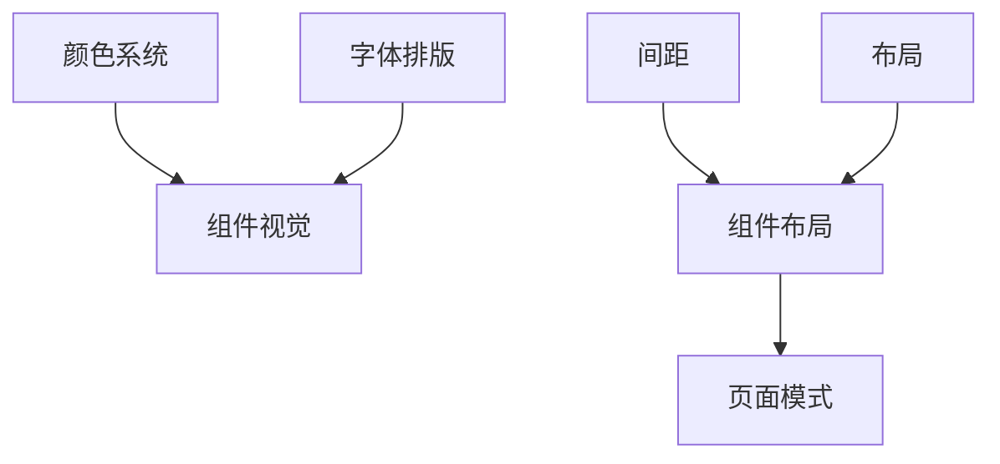

# beautiful-mermaid 图表渲染器集成方案

> 计划文档，供后续实现参考。状态：待实现。

---

## 可行性结论

**可以使用**。beautiful-mermaid 与当前技术栈兼容：

- **零 DOM 依赖**：纯 TypeScript，可在 Node（SSR）和浏览器运行
- **支持 5 种图类型**：Flowchart、State、Sequence、Class、ER
- **15 套内置主题**：仅选用浅色、深色各一种，降低复杂度
- **SVG 输出**：适合嵌入 HTML，无额外运行时

---

## 当前架构

- 文档渲染：[components/DocContent.tsx](../components/DocContent.tsx) 使用 `react-markdown` + `remark-gfm` + `remark-breaks`
- 无 Mermaid 支持，` ``` ` 代码块按普通 `<pre><code>` 渲染
- 深浅色主题：`data-theme` + TokenProvider，主题存储在 `localStorage`

---

## 实现思路

### 1. 服务端预渲染 + 双 SVG 主题方案（方案 A）

在 [app/docs/[[...slug]]/page.tsx](../app/docs/[[...slug]]/page.tsx) 获取 markdown 后、传入 DocContent 前，对 ` ```mermaid ` 代码块做预处理：

1. 用正则 `/```mermaid\r?\n([\s\S]*?)```/g` 匹配所有 mermaid 块
2. 对每个块**并行**调用 `renderMermaid(source, lightTheme)` 与 `renderMermaid(source, darkTheme)`（`Promise.all`）
3. 用双 div 包裹两份 SVG，输出结构：
   ```html
   <div class="doc-mermaid">
     <div class="doc-mermaid--light">...(浅色 SVG)...</div>
     <div class="doc-mermaid--dark">...(深色 SVG)...</div>
   </div>
   ```
4. 在 ReactMarkdown 中使用 `rehype-raw`（解析 HTML）+ `rehype-sanitize`（先 parse 后 sanitize，顺序不可颠倒），以便安全渲染这些 HTML 片段
5. 用 CSS 根据 `[data-theme]` 显示/隐藏对应版本，无需 client 组件

**优点**：无 hydration 闪烁、无主题同步 client 逻辑、与现有首帧 `data-theme` 脚本兼容。

### 2. 主题选型

仅加载浅色、深色各一种：

- 浅色：`THEMES['github-light']` 或 `THEMES['zinc-light']`
- 深色：`THEMES['github-dark']` 或 `THEMES['zinc-dark']`

可内联定义最小 theme 对象以减小依赖体积，例如：

```ts
const LIGHT = { bg: '#ffffff', fg: '#27272a' };
const DARK = { bg: '#0d1117', fg: '#c9d1d9' };
```

### 3. 核心改动点

| 文件 | 改动 |
|------|------|
| `package.json` | 新增 `beautiful-mermaid`、`rehype-raw`、`rehype-sanitize`（安全必配） |
| `lib/content/mermaid-render.ts` | 新建：`transformMermaidBlocks(markdown)`，解析、双主题渲染、包裹双 div |
| `app/docs/[[...slug]]/page.tsx` | 在 `normalizedMarkdown` 之后调用 `transformMermaidBlocks` |
| `components/DocContent.tsx` | 添加 `rehype-raw` + `rehype-sanitize`（schema 放行 SVG） |
| `app/globals.css` | `.doc-mermaid` 布局；`[data-theme='light'] .doc-mermaid--dark { display: none }` 等 |

**不创建** `MermaidThemeSync` 等 client 组件。

### 4. 内容写法

文档中按标准 Mermaid 语法书写，例如：



现有 C00_README 中的 ASCII 图可保持不变，也可在需要时改写为 Mermaid。

### 5. 注意事项

- **错误处理**：若 Mermaid 语法错误，`renderMermaid` 可能抛出，需 try/catch 并 fallback 为原代码块展示
- **构建耗时**：每个 mermaid 块渲染 2 次（浅+深），静态生成时 build 时间略增

---

## 最佳实践（Vercel React / 安全）

### 安全（必须）

- **rehype-sanitize 必配**：`rehype-raw` 仅解析 HTML，不具备 XSS 防护。须与 `rehype-sanitize` 配合，在允许的 schema 中放行 SVG 相关标签（svg、path、g、defs、rect、circle、text 等），剥离 `script`、`on*` 事件、`javascript:` 等。默认 GitHub schema 可能过滤部分 SVG，需传入 `ghSchema` 扩展或自定义 schema。参考 [unified rehype-sanitize](https://unifiedjs.com/explore/package/rehype-sanitize)。

### 性能

- **多块并行**：同一文档内有多个 mermaid 块时，用 `Promise.all()` 并行渲染每个块内的 light/dark，块之间也可并行
- **RegExp 提升**：正则 `/```mermaid\r?\n([\s\S]*?)```/g` 放在模块顶层
- **React.cache()**：`transformMermaidBlocks` 用 `React.cache()` 包裹，实现请求级去重
- **可选 LRU 缓存**：dev/ISR 下同一文档频繁请求时，可按 `relativePath` 或 `contentHash` 缓存转换结果

### 包体积

- **仅服务端加载**：`beautiful-mermaid` 仅在 `page.tsx` / `mermaid-render.ts` 等服务端模块中 import，不进入 client bundle

---

## 工作量评估（方案 A）

| 任务 | 预估时间 |
|------|----------|
| 依赖安装 | 5 分钟 |
| `lib/content/mermaid-render.ts` | 1–1.5 小时 |
| `app/docs/[[...slug]]/page.tsx` | 10 分钟 |
| `components/DocContent.tsx` | 30–45 分钟 |
| `app/globals.css` | 15 分钟 |
| 测试与边界情况 | 30 分钟 |

**总计：约 2.5–3.5 小时**

---

## 参考资料

- [beautiful-mermaid](https://github.com/lukilabs/beautiful-mermaid)
- [rehype-raw](https://unifiedjs.com/explore/package/rehype-raw)
- [rehype-sanitize](https://unifiedjs.com/explore/package/rehype-sanitize)
